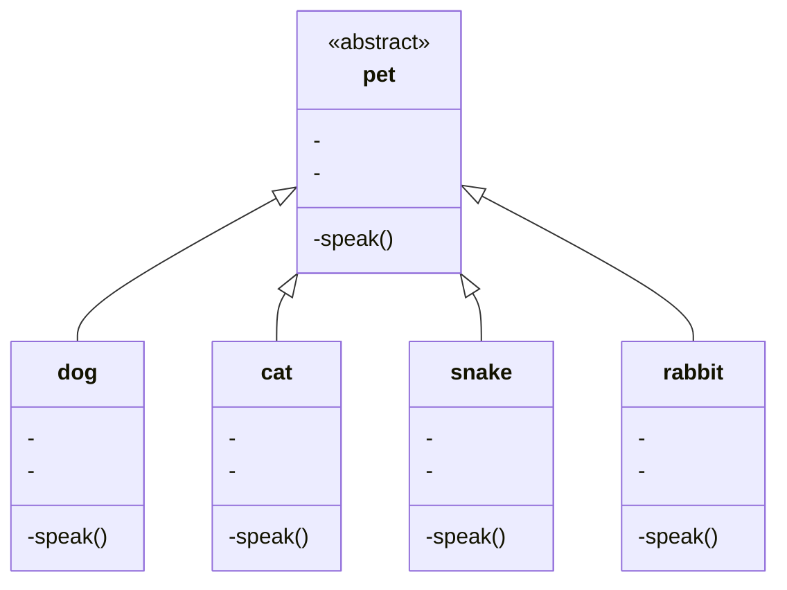

```mermaid
classDiagram
    class pet{
     <<abstract>>
        -speak()
        -
        -
    }
    class dog{
        -speak()
        -
        -
    }
     class cat{
        -speak()
        -
        -
    } 
    class snake{
        -speak()
        -
        -
    } 
    class rabbit{
        -speak()
        -
        -
    }
pet <|-- dog
pet <|-- cat
pet <|-- snake
pet <|-- rabbit


```